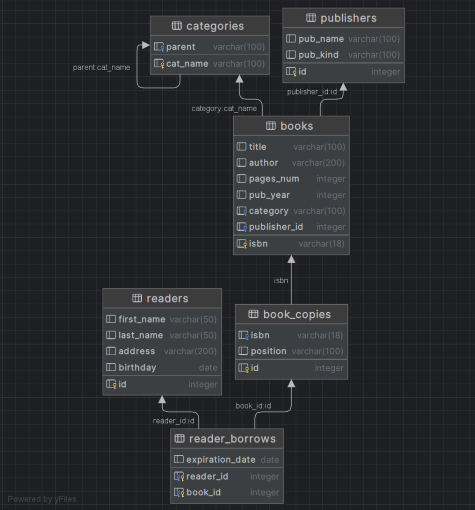
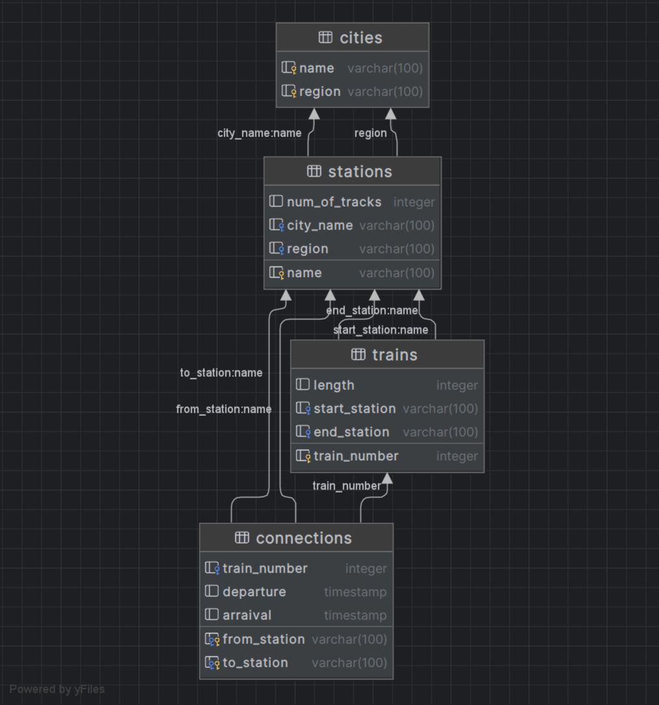
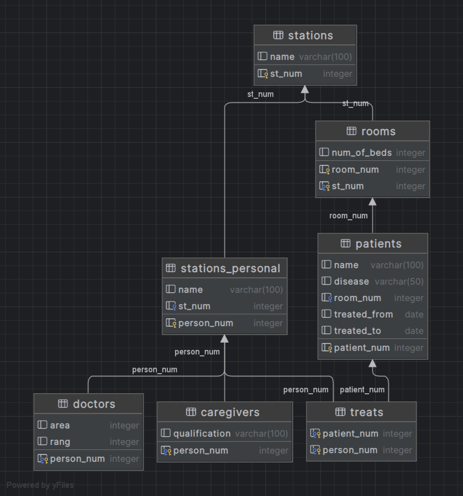

# Домашнее задание номер 4 (на оценку третье)

## Выполнил - Иванов Дмитрий Сергеевич, БПИ214

### Схемы баз данных из DataGrip:

#### 1. Библиотека

#### 2. Поезда

#### 3. Госпиталь

Скрипты лежат в `.\docker\db\scripts`. Конфиг, вытянутый из одного из контейнеров - в `.\docker\db\config`. Можно заметить, что тут слэши в пути выглядят отлично от того, как это есть в MacOS или Linus, так как ДЗ выполнено в windows (11).